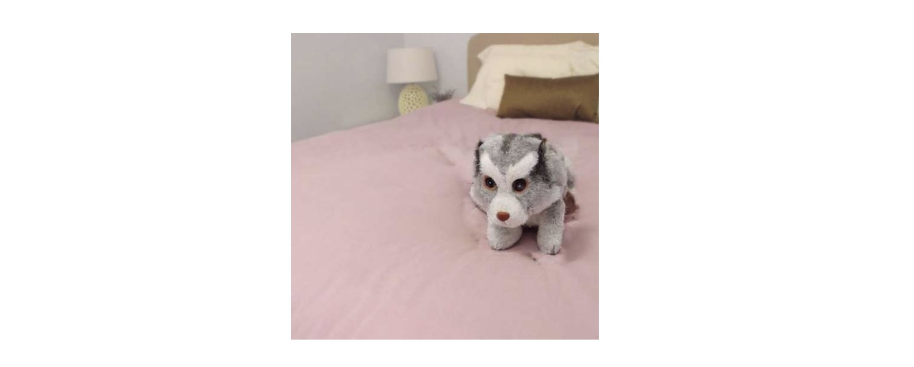

# Subject-driven Image Editing Research

This repository summarizes my undergraduate research experience on **subject-driven image editing** using diffusion-based generative models.

The main focus of this work was to explore how to preserve the identity of a reference subject while naturally editing or inserting it into a target image.

> This repository was originally started as an experimental workspace for KV-Edit-based feature injection experiments.

---

## Research Experience

- **Position:** Undergraduate Research Student
- **Lab:** Multimodal AI Lab (Inha University)
- **Duration:** 1 year and 4 months
- **Research Area:** Subject-driven image editing, diffusion-based generative models, attention / feature-level image editing

---

## Motivation & Research Background

Subject-driven image editing is a promising technology with practical applications in various industries, including virtual try-on, interior design, product placement, and personalized content creation.

I became interested in this field because it can provide real user value while involving challenging research problems such as reference identity preservation, natural object insertion, background consistency, and edit controllability.

At the beginning of my research in early 2025, I first investigated how recent subject-driven image editing and reference-based generation methods performed in practice. I reviewed and tested several related methods, including **AnyDoor**, **Tuning-Free Image Customization with Image and Text Guidance (ECCV 2024)**, **SISO**, **InstantSwap**, and **MasaCtrl**.

Through this process, I observed that many existing methods could edit or insert the target subject to some extent, but they often caused unintended changes in regions that should have remained unchanged. In particular, preserving the surrounding background and layout while modifying only the desired subject region was still a challenging problem.

Based on these observations, I focused my undergraduate research on diffusion-based subject-driven image editing, especially on attention analysis and feature-level manipulation for improving identity preservation and background consistency.


## Research Direction

I selected **KV-Edit(ICCV 2025)** as the base model for this research because I believed it could effectively preserve the surrounding background during image editing.

Background preservation is an important challenge in subject-driven image editing, since the model must edit only the desired region while keeping the rest of the image visually consistent.

However, KV-Edit is fundamentally a generation model, and it cannot directly perform reference-image-based image editing. In other words, it has limitations in understanding a given reference image and using it to preserve the subject's identity during the editing process.

To address this limitation, I conducted research on extending the KV-Edit framework so that it could better understand reference images, preserve subject identity, and generate edited images that also follow the given text condition.

The main goal of this research was to explore how a generative editing model can incorporate reference-image information while maintaining both identity preservation and background consistency.


---

### 0
The official KV-Edit GitHub repository uses Gradio, but we converted it into a CLI-based implementation.

---

### 1. KV-Edit-based Feature Injection

To enable reference-based editing in the generative KV-Edit model, I investigated feature injection strategies for better identity preservation:

Goal: Enable the model to understand reference subjects while following text conditions.

Method: Conducted initial experiments by injecting reference Key/Value features into all timesteps and attention layers of the generation process.


---

### 2. Feature Injection into Vital Layers

Following the initial experiments, I conducted further research by injecting Key and Value features only into "Vital Layers" instead of all layers.

This approach was inspired by the Stable Flow paper.

Vital Layers = [0,1,2,17,18,25,28,53,54,56]


---

### 3. Removing RoPE (Rotational Position Embedding) in Vital Layers
I experimented with removing the RoPE (Rotational Position Embedding) from the FLUX model, an approach inspired by the CharaConsist paper.

In the standard FLUX architecture, the positional embeddings tend to bias the attention mechanism toward spatial correspondence rather than semantic relevance. By removing RoPE, I aimed to break this rigid spatial dependency, allowing the model to perform more flexible, content-aware attention for better subject integration.



---

In addition, I tried several other approaches, such as editing with a union mask, injecting K and V features into early and late layers, visualizing attention maps, and editing using Zero123, but they did not improve performance..

---

### 
One possible reason for the limited performance improvement is that the base KV-Edit framework was not specifically designed for masked reference-based image editing. Since it does not explicitly learn how to use a reference image to fill or modify a masked region, direct K/V feature injection may be insufficient for stable subject transfer.

In future work, using an inpainting-oriented model such as FLUX Fill could be a more suitable direction, as it is better aligned with masked-region editing and background-preserving generation.

### Reflection
이 프로젝트를 통해 단순히 pre-trained 모델을 사용하는 것을 넘어, 모델 내부 구조를 코드 레벨에서 분석하고 가설을 세워 검증하는 연구 사이클을 직접 경험했다. KV-Edit의 코드를 분해하고, 어텐션 맵으로 원인을 추적하고, 관련 논문을 탐색해 구조 수정으로 이어지는 사이클은, 향후 어떤 AI 모델을 만나도 빠르게 구조를 파악하고 개선점을 찾아낼 수 있는 자산이 되었다.

### Usage
```
python cli_kv_edit.py \
    --input_image "003.jpg" \
    --mask_image "ref_mask3.jpg" \
    --ref_image "011.png" \
    --ref_mask_image "ref_mask3.jpg" \
    --source_prompt "a bag is on the floor" \
    --target_prompt "a dog is sitting on the floor" \
    --re_init
```
---
This experiment was conducted using a single A40 GPU.
